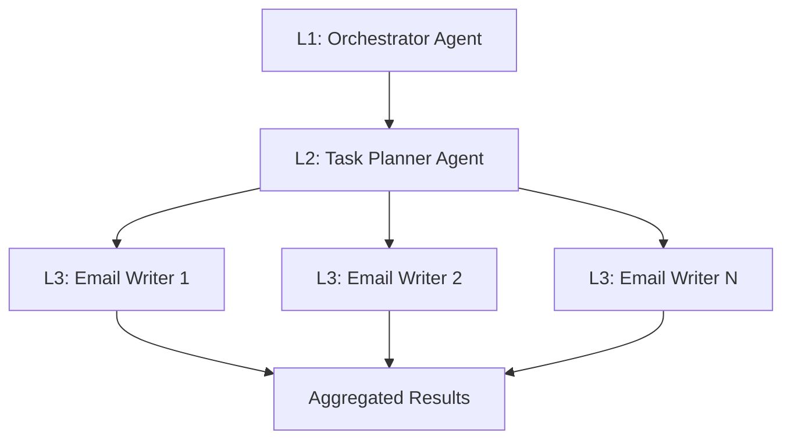

# Stakeholder Email Outreach System: Comprehensive Guide

**Version:** 2.0  
**Last Updated:** December 2025  
**Purpose:** This document provides a complete, unified reference for the Stakeholder Email Outreach System, covering architecture, development, testing, and usage. It is designed for developers, AI agents, and end-users.

---

## Table of Contents

1.  **[System Overview](#system-overview)**
    -   [Purpose & Core Workflow](#purpose--core-workflow)
    -   [Technology Stack](#technology-stack)
2.  **[System Architecture](#system-architecture)**
    -   [Architectural Principles](#architectural-principles)
    -   [Agent Hierarchy](#agent-hierarchy)
    -   [Agent Specifications](#agent-specifications)
    -   [Data Flow & Communication](#data-flow--communication)
3.  **[Email Generation System](#email-generation-system)**
    -   [Mode 1: AI-Generated Styles](#mode-1-ai-generated-styles)
    -   [Mode 2: User-Editable Templates](#mode-2-user-editable-templates)
    -   [Mode 3: Custom User Prompts](#mode-3-custom-user-prompts)
4.  **[Usage Guide](#usage-guide)**
    -   [Command-Line Interface (CLI)](#command-line-interface-cli)
    -   [Web Application Interface](#web-application-interface)
5.  **[Testing & Quality Assurance](#testing--quality-assurance)**
    -   [Test Architecture & Strategy](#test-architecture--strategy)
    -   [Running Tests](#running-tests)
    -   [Test Catalog & Debugging](#test-catalog--debugging)
6.  **[Development Guide](#development-guide)**
    -   [Development Roadmap](#development-roadmap)
    -   [File Structure Reference](#file-structure-reference)
    -   [Guidelines for AI Coding Agents](#guidelines-for-ai-coding-agents)

---

## 1. System Overview

### Purpose & Core Workflow

This system automates personalized email outreach to key stakeholders identified in customer research reports. It uses a hierarchical multi-agent system to analyze reports, identify stakeholders, and generate high-quality, context-aware emails in parallel.

**Core Workflow:**
```
Report Upload → Stakeholder Extraction → User Selection → Style Configuration → Parallel Email Generation → Quality Review → Final Drafts
```

### Technology Stack

-   **Language:** Python 3.11+
-   **LLM Provider:** OpenRouter
-   **Core Model:** `google/gemini-2.5-flash`
-   **Concurrency:** `asyncio`
-   **Web Backend:** FastAPI
-   **Web Frontend:** React, TypeScript, TailwindCSS

---

## 2. System Architecture

### Architectural Principles

-   **Hierarchical Multi-Agent System (HMAS):** A three-layer hierarchy (Strategy, Planning, Execution) provides clear separation of concerns.
-   **Concurrent Orchestration:** A fan-out/fan-in pattern enables parallel email generation for multiple stakeholders, maximizing efficiency.
-   **Reflection Pattern:** Each execution agent self-evaluates and refines its output to ensure high quality.

### Agent Hierarchy

The system is composed of three layers of agents:



### Agent Specifications

| Agent | Layer | Responsibilities |
| :--- | :--- | :--- |
| **Orchestrator** | 1 (Strategy) | Manages the end-to-end workflow, user interaction, and coordinates sub-agents. |
| **Task Planner** | 2 (Planning) | Decomposes the main goal into parallel sub-tasks and prepares context for each. |
| **Email Writer** | 3 (Execution) | Executes a single task (email generation) and implements the reflection pattern. |

### Data Flow & Communication

Communication between agents uses JSON-serializable Python dictionaries. The flow is sequential from Layer 1 to 3 and back.

1.  **User Input** is received by the **Orchestrator**.
2.  The **Orchestrator** extracts stakeholders and gets user selection.
3.  It delegates to the **Task Planner**, providing context.
4.  The **Task Planner** creates and dispatches tasks to multiple **Email Writer** agents in parallel.
5.  **Email Writers** execute, refine, and return results.
6.  The **Task Planner** aggregates results and returns them to the **Orchestrator**.
7.  The **Orchestrator** presents the final drafts to the user.

---

## 3. Email Generation System

The system offers three modes for email generation, providing a spectrum of control vs. automation.

### Mode 1: AI-Generated Styles

Fully automated generation based on pre-defined style prompts. The user chooses a style, and the AI handles the rest.

**Available Styles:**
-   **Professional to Healthcare Professional:** Formal, evidence-based, clinical.
-   **Casual Bro-y:** Direct, conversational, urgent.
-   **Technical and Direct:** Specification-focused, data-driven.
-   **Executive Brief:** Strategic, high-level, concise.
-   **Consultative:** Collaborative, problem-solving, question-based.

### Mode 2: User-Editable Templates

A hybrid approach where the user customizes pre-structured templates. The AI fills in context-specific details around the user-provided content.

**Template Structure:**
-   **User-Editable Fields:** Subject, Opening, Key Benefits, Call to Action.
-   **AI-Generated Fields:** Context/Problem Statement, Specific Application to Stakeholder.

### Mode 3: Custom User Prompts

Provides complete user control. The user writes their own detailed prompt, and the system injects contextual variables (`{stakeholder_name}`, `{company_summary}`, etc.) before sending it to the LLM.

---

## 4. Usage Guide

### Command-Line Interface (CLI)

**1. Installation & Setup:**
```bash
# Install dependencies
pip install -r requirements.txt

# Set API key
export OPENROUTER_API_KEY=\'your-api-key-here\'
```

**2. Run the Application:**
```bash
python main.py path/to/your/report.txt
```
The application will guide you through stakeholder and style selection.

### Web Application Interface

*(This section describes the planned web application)*

The web app will provide a user-friendly graphical interface for the entire workflow:

1.  **Report Upload:** Drag-and-drop a research report file.
2.  **Stakeholder Selection:** Review the automatically extracted stakeholders and select targets with checkboxes.
3.  **Style Configuration:**
    -   Select one of the three generation modes.
    -   Choose a style, edit a template, or write a custom prompt in a rich text editor.
4.  **Draft Review:** View generated emails, quality scores, and reflection notes side-by-side.
5.  **Debug Readout:** A console view shows agent logs and error messages with associated test IDs for traceability.
6.  **Documentation Viewer:** An integrated viewer to browse this comprehensive guide.

---

## 5. Testing & Quality Assurance

### Test Architecture & Strategy

A four-level test pyramid ensures robust quality assurance:
-   **L1: Unit Tests:** Isolate and test individual components.
-   **L2: Integration Tests:** Verify agent interactions.
-   **L3: End-to-End Tests:** Validate the full workflow with mocked APIs.
-   **L4: Live API Tests:** Confirm real-world integration with the Gemini 2.5 Flash model.

### Running Tests

A `run_tests.sh` script provides easy access to different test suites:

```bash
# Run fast unit tests for development
./run_tests.sh quick

# Run all tests except live API calls (pre-commit)
./run_tests.sh all

# Verify Gemini 2.5 Flash integration specifically
./run_tests.sh gemini
```

### Test Catalog & Debugging

-   **Test Catalog:** A complete inventory of all 46+ tests is available in `tests/TEST_CATALOG.md`.
-   **Traceable IDs:** Every test has a unique ID (e.g., `L1-AGENT-EMAIL-001`) for systematic debugging.
-   **Debugging:** The testing guide provides a step-by-step process for debugging failed tests by isolating them using their unique ID.

---

## 6. Development Guide

### Development Roadmap

The project follows a phased roadmap to manage complexity and prevent context loss. The current focus is on building the web application interface.

-   **Phase 1-5 (Completed):** Core agentic system implementation and testing.
-   **Phase 6 (Current):** Web application development (backend API, frontend UI).
-   **Phase 7 (Next):** Final integration, testing, and deployment.

### File Structure Reference

```
stakeholder_outreach/
├── agents/              # Core agent implementations
├── prompts/             # LLM prompt templates
├── tests/               # Test suite (unit, integration, etc.)
├── utils/               # Shared utilities (e.g., LLM client)
├── main.py              # CLI entry point
├── ARCHITECTURE.md      # Detailed architecture reference
└── TESTING_GUIDE.md     # Comprehensive testing guide

stakeholder_webapp/      # New web application project
├── src/
│   ├── api/           # Backend API (FastAPI)
│   └── web/           # Frontend UI (React)
└── ...
```

### Guidelines for AI Coding Agents

To ensure consistent and context-aware development, AI agents should:
1.  **Reference this document first** to understand the overall architecture and current status.
2.  **Follow the phased roadmap** for implementation.
3.  **Adhere to the defined data contracts** for inter-agent and API communication.
4.  **Implement new tests** for any new features, following the established test catalog format.
